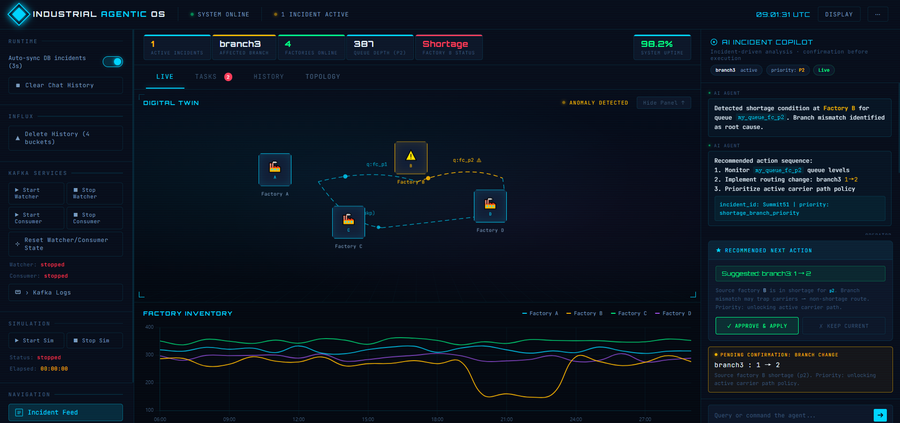
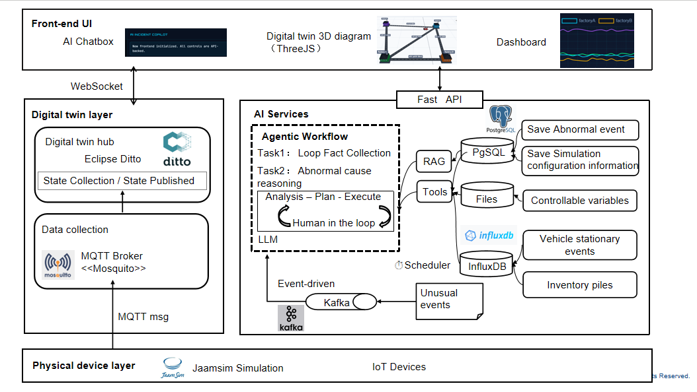
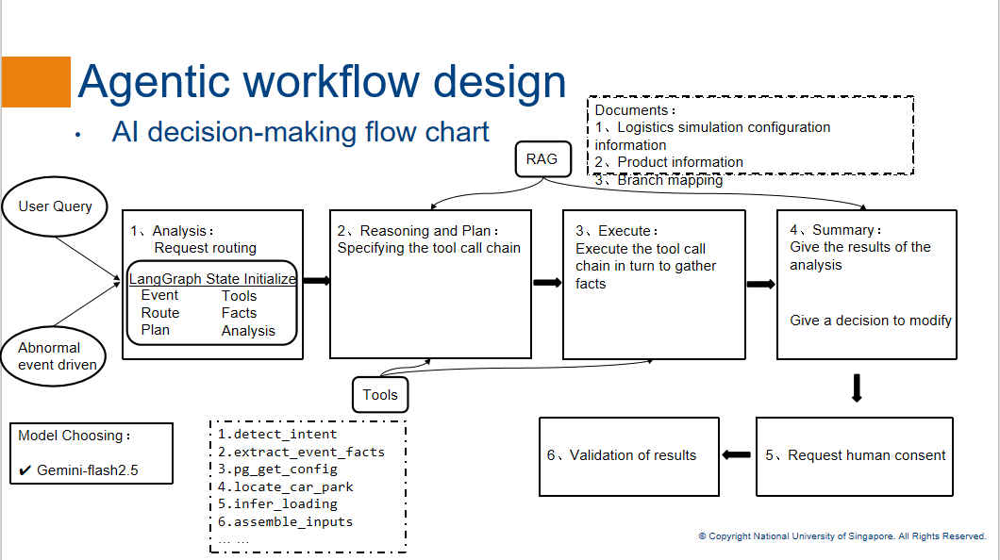

# JaamSim AI RCA

An AI-assisted root cause analysis platform for logistics simulation, built around JaamSim, Kafka, FastAPI, InfluxDB, PostgreSQL, and a human-in-the-loop decision workflow.



This project is designed as an interactive operations cockpit rather than a standalone model demo. The frontend combines a digital twin view, live inventory dashboard, runtime controls, and an AI incident copilot so that operators can move from abnormal event detection to RCA explanation and then to a controlled corrective action in one interface.

At the core of the system is a practical engineering question: when an abnormal event happens in a simulated production and transport network, how do we move from raw telemetry and alert signals to an explainable RCA conclusion, and finally to a safe, reviewable branch-level action?

## Project Overview

The system connects four concerns into one end-to-end workflow:

- **simulation and telemetry**: JaamSim produces vehicle, route, branch, and inventory-related state
- **event ingestion**: abnormal events are captured through InfluxDB polling or FastAPI webhooks and routed into Kafka
- **agentic reasoning**: an AI workflow gathers facts from databases, files, branch mappings, and time-series signals before generating RCA output
- **operator-facing decision support**: the UI shows evidence, proposed fixes, and requires confirmation before any branch change is applied

Instead of treating RCA as a pure LLM text-generation task, this project uses a structured workflow where the model is only one part of the reasoning chain. Deterministic tools collect operational facts first, and the final analysis is grounded in simulation topology, branch state, transport paths, and recent metrics.



## Why This Project Matters

This repository is designed as a portfolio project around **industrial AI reasoning** rather than only dashboarding or model integration.

The core value is the RCA layer:

- turning abnormal events into structured incident facts
- distinguishing symptoms from underlying causal bottlenecks
- combining rule-based reasoning with LLM summarization
- proposing corrective branch changes with explicit evidence
- keeping a human approval gate before execution

In other words, the project is about building an **explainable AI operations workflow**, not just a chatbot on top of logs.

## System Architecture

The platform is organized as a layered architecture:

### 1. Physical and Simulation Layer

- JaamSim models the logistics environment
- simulation files define branches, paths, product movement, and runtime behavior
- sensor and MQTT-style data can represent upstream operational state

### 2. Digital Twin and Event Layer

- abnormal events are collected from runtime signals
- Kafka acts as the event backbone for decoupled ingestion and analysis
- InfluxDB stores time-series state used for alerts and trend analysis

### 3. AI Service Layer

- FastAPI exposes webhook and UI-facing APIs
- the workflow engine prepares plans, executes tools, and assembles RCA evidence
- PostgreSQL stores incident records and analysis results
- the reasoning layer can propose branch-level corrective actions

### 4. UI and Human-in-the-Loop Layer

- Streamlit and HTML-based UI components present the digital twin and incident workflow
- the operator can inspect evidence, review RCA output, and approve or reject branch changes

## Agentic Workflow



The workflow is intentionally staged so that analysis is inspectable and controllable:

1. **Input normalization**
   User queries and abnormal events are converted into a common workflow state.

2. **Intent detection and routing**
   The system decides whether the request is incident RCA, data query, or action-oriented analysis.

3. **Fact collection**
   Tools gather structured evidence from:
   - branch configuration files
   - PostgreSQL configuration and incident data
   - InfluxDB metrics and time-series state
   - event payload details such as `thingId`, branch values, and car position

4. **Reasoning and plan execution**
   The workflow determines which tools to call and in what order. This keeps the LLM from answering before operational facts are known.

5. **RCA generation**
   Deterministic logic classifies likely causes, and the model summarizes the causal chain, evidence, confidence, and next checks.

6. **Action proposal**
   If the workflow identifies a likely branch-routing issue, it generates a branch-fix proposal with current value, recommended value, and justification.

7. **Human approval**
   The branch change is not applied automatically. The operator confirms the proposed action in the UI.

8. **Validation**
   The system can verify whether the applied change restores expected movement or reduces the abnormal condition.

## RCA Design Highlights

The RCA portion is the most important part of this project.

### 1. Structured Incident Understanding

The system first extracts normalized facts from raw event data:

- abnormal event type
- affected entity or vehicle
- event time
- reported branch key and branch value
- vehicle position
- human-readable abnormal message

This step makes later reasoning more robust because downstream logic works on structured facts instead of brittle free text.

### 2. Rules-First, LLM-Second Reasoning

A key design decision is that the model does not directly guess the root cause from the alert message alone.

Instead, the workflow:

- collects the required inputs for the affected product flow
- checks queue and inventory evidence from time-series data
- maps shortage signals back to source factories and logistics edges
- checks whether branch settings match the intended transport path
- only then asks the model to summarize the RCA result

This reduces hallucination risk and makes the output more defensible.

### 3. Root Cause vs Symptom Separation

In logistics systems, many alerts are downstream symptoms rather than primary causes. For example:

- a stopped vehicle may be caused by a blocked route rather than a vehicle fault
- an empty queue may be caused by upstream transport misrouting rather than low production
- a local shortage may actually originate from branch settings that prevent carriers from returning to the correct source path

The RCA logic is designed to reason across topology and dependencies, rather than stopping at the first visible symptom.

### 4. Transport-Aware Branch Fix Proposal

The workflow can propose a branch change when evidence suggests a routing mismatch. This proposal is not a blind recommendation; it is generated from:

- current branch values
- expected branch value on relevant logistics edges
- shortage products and their source factories
- observed incident branch
- transport policy rules derived from configuration

That makes the suggested fix traceable to the actual structure of the simulated system.

### 5. Explainability and Operational Safety

Each RCA result is designed to answer:

- what likely failed
- why the system believes that
- what evidence supports the conclusion
- what should be checked next
- what action is suggested

The final action remains human-approved, which is important for any operational AI workflow that can affect system behavior.

## Example RCA Scenario

A representative scenario in this project is a stationary vehicle incident in the logistics network.

The workflow does not stop at "vehicle stopped moving." It tries to answer deeper questions:

- Is the vehicle blocked because the destination path is wrong?
- Is a product queue empty because production is low, or because transport is not returning to the right branch?
- Is the currently active branch consistent with the shortage route implied by topology?

This turns the RCA result from a surface-level alert explanation into a more useful operational diagnosis.

## Technical Stack

- **Simulation**: JaamSim
- **Event bus**: Kafka
- **API layer**: FastAPI
- **AI orchestration**: workflow graph plus tool-based execution
- **Time-series storage**: InfluxDB
- **relational storage**: PostgreSQL
- **UI**: Streamlit, HTML, Three.js

## Repository Structure

```text
jaamsim-ai-rca/
+-- ai/             # workflow, reasoning graph, tools, RCA logic
|   `-- tools/
|       `-- rca_tools.py
+-- api/            # FastAPI endpoints and webhook/UI APIs
+-- app/            # controllers and renderers for the app layer
+-- services/       # watcher, consumer, MQTT bridge
+-- simulation/     # JaamSim runtime and logistics configuration
+-- ui/             # dashboard and digital twin resources
+-- db/             # database initialization scripts
+-- doc/            # architecture and workflow figures
+-- streamlit_app.py
`-- README.md
```

## Key Engineering Ideas

### Event-Driven Analysis

The system reacts to abnormal events rather than relying only on manual querying. This makes the RCA workflow closer to real monitoring and operations scenarios.

### Tool-Augmented Reasoning

The analysis process is built around tools, not a single prompt. That allows the workflow to retrieve evidence, compare branch states, inspect topology, and ground the final answer in system data.

### Human-in-the-Loop Execution

The project treats AI as a decision-support layer, not an always-autonomous controller. This is especially important when the recommended action changes routing behavior.

### Digital Twin Integration

The UI is not only a text console. It combines AI analysis, live inventory trends, and digital twin visualization so that reasoning and operational state can be inspected together.

## What I Wanted to Demonstrate

This project was built to demonstrate the ability to design and implement:

- AI-native RCA workflows for industrial or cyber-physical systems
- multi-stage reasoning pipelines instead of single-step prompting
- event-driven system integration across simulation, streaming, storage, and UI
- explainable corrective action recommendation with safety controls
- product thinking around operator trust, observability, and intervention

## Notes

- The repository is intended as a public project showcase, so secrets should remain in `.env` and never be committed.
